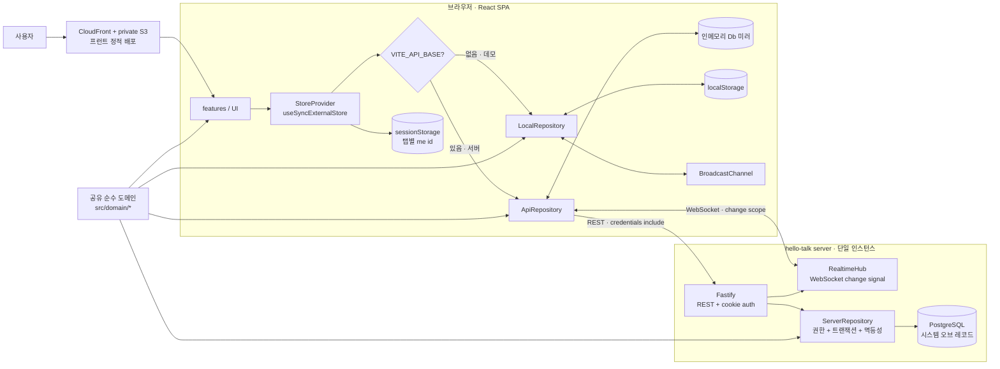
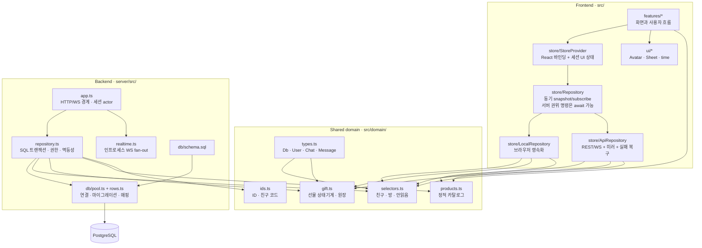
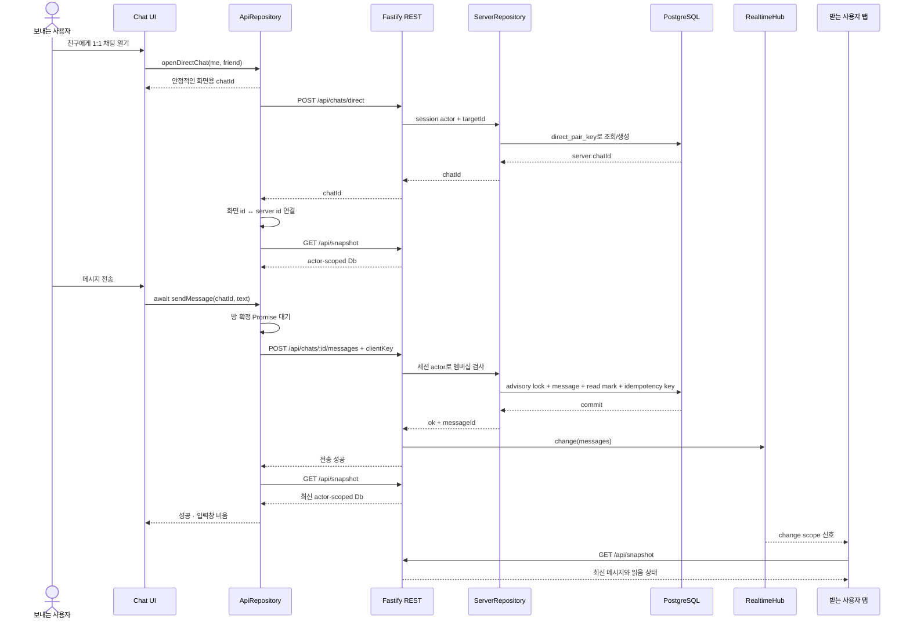
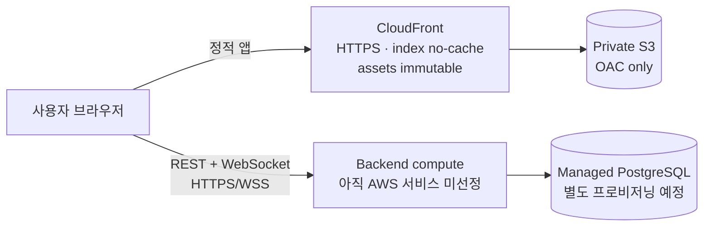

# hello-talk 아키텍처

> 기준: `main` @ `14a0c9f` · 2026-09-16
>
> 이 문서는 **현재 구현된 구조**를 설명한다. 향후 백엔드 컴퓨트 서비스, Redis, 푸시 알림 등
> 아직 선택하지 않은 구성은 현재 구조와 분리해 명시한다.

## 1. 시스템 컨텍스트와 두 실행 모드

hello-talk 프런트엔드는 같은 React UI를 유지하면서 `VITE_API_BASE` 유무로 데이터 소스를 고른다.
데모 모드의 진실은 브라우저에 있고, 서버 모드의 진실은 PostgreSQL에 있다.

### 진실의 위치

| 모드 | 시스템 오브 레코드 | 탭 간/실시간 동기화 | 용도 |
|---|---|---|---|
| 데모 | 브라우저 `localStorage` | `BroadcastChannel` (`storage` 이벤트 fallback) | 한 브라우저 안에서 기능 시연 |
| 서버 | PostgreSQL | 인증 WebSocket 신호 → actor-scoped snapshot 재조회 | 다른 브라우저·기기의 실제 두 사용자 |

`sessionStorage`의 `me` 값은 UI 복원용이다. 서버 모드에서 권한을 결정하는 행위자는 항상 서명된
HttpOnly 세션 쿠키에서 나온다.

## 2. 컨테이너와 모듈 경계

의존성은 UI에서 저장소 인터페이스를 거쳐 아래로 흐른다. `src/domain`은 React, DOM, 네트워크,
저장소를 모르며 프런트와 서버가 같은 규칙을 직접 재사용한다.

### 경계별 책임

| 경계 | 책임 | 책임이 아닌 것 |
|---|---|---|
| `features/` | 입력, 화면 상태, 성공·실패 표시 | 권한·선물 규칙·DB 접근 |
| `Repository` | UI가 데이터를 읽고 명령하는 단일 창구 | 특정 영속화 방식 노출 |
| `src/domain/` | 순수 규칙과 계산 | React·HTTP·SQL·브라우저 API |
| `server/src/app.ts` | 세션 actor, 요청 검증, HTTP/WS 응답 | 도메인 상태 전이 재구현 |
| `ServerRepository` | 트랜잭션, SQL 권한 검사, 멱등 부수효과 | UI 상태 |
| PostgreSQL | 서버 모드의 영속 상태와 제약 | 정적 상품 카탈로그 |

## 3. 서버 모드 메시지 전송 시퀀스

새 1:1 방에서는 임시 화면 ID를 쓸 수 있지만, 메시지는 서버 방 ID가 확정될 때까지 기다린다.
메시지 입력은 서버 저장이 성공한 뒤에만 비워지며, 실패하면 원문과 실패 이유를 유지한다.

### 실패와 복구

- 네트워크·권한·서버 거절: 입력을 지우지 않고 사람이 읽을 실패 이유를 표시한다.
- HTTP 401: 인메모리 미러와 탭의 로그인 상태를 지우고 WebSocket 재연결 루프를 멈춘다.
- WebSocket 일시 단절: 재연결하면서 snapshot을 다시 받아 놓친 변경을 따라잡는다.
- 동일 `clientKey` 재시도: advisory lock, 부수효과, 결과 저장이 **같은 커넥션·트랜잭션**에서 실행된다.

## 4. 데이터와 일관성 불변식

| 불변식 | 강제 위치 |
|---|---|
| 친구 관계는 단방향이다 | `friendships(owner_id, friend_id)` + selectors |
| 두 사람의 1:1 방은 하나다 | `direct_pair_key` 부분 unique index |
| 방 멤버만 메시지를 보내고 읽음 표시를 쓴다 | 서버 SQL 멤버십 검사 |
| 안읽음 카운터를 저장하지 않는다 | `lastReadAt` 이후 타인 메시지로 계산 |
| 선물 상태는 `paid → accepted → used`, 종료는 `refunded` | `checkGiftAction` / `applyGiftAction` |
| 만료는 저장 상태가 아니라 시간으로 계산한다 | gift selectors |
| 정산은 결제 당시 가격과 append-only ledger를 따른다 | `GiftOrder` + `gift_orders.ledger` |
| 내용이 같은 쓰기는 구독자·WebSocket을 깨우지 않는다 | Local/API commit 비교 + mutation `changed` |
| 행위자 ID는 요청 바디를 신뢰하지 않는다 | 서명 HttpOnly 쿠키 → server actor |
| 메시지·선물 재시도는 중복 부수효과를 만들지 않는다 | advisory lock + `idempotency_keys` |

## 5. 배포 경계와 현재 한계

- 프런트 배포는 Terraform으로 관리하는 private S3 + CloudFront + OAC다.
- 백엔드 컴퓨트 서비스와 백엔드 IaC는 아직 선택하지 않았다.
- WebSocket fan-out은 현재 프로세스 메모리 안에서만 동작하므로 서버는 단일 인스턴스 전제다.
  다중 인스턴스에서는 Redis Pub/Sub 같은 공유 fan-out이 필요하다.
- WebSocket 신호는 델타가 아니라 scope 힌트다. 클라이언트는 신호를 받으면 actor-scoped snapshot을
  다시 읽는다. 규모가 커지면 대상 사용자 fan-out과 델타 전송이 필요하다.
- 인증은 공개 데모 수준이다. 운영에서 임의 기존 사용자 로그인은 막혀 있지만 비밀번호·외부 IdP는 없다.

## 6. 코드 탐색 출발점

- 프런트 데이터 계약: [`src/store/repository.ts`](../src/store/repository.ts)
- React 바인딩과 세션: [`src/store/StoreProvider.tsx`](../src/store/StoreProvider.tsx)
- 서버 미러: [`src/store/apiRepository.ts`](../src/store/apiRepository.ts)
- 서버 HTTP/WS 경계: [`server/src/app.ts`](../server/src/app.ts)
- 서버 트랜잭션: [`server/src/repository.ts`](../server/src/repository.ts)
- DB 스키마: [`server/src/db/schema.sql`](../server/src/db/schema.sql)
- 선물 상태기계: [`src/domain/gift.ts`](../src/domain/gift.ts)
- 상세 실행·API: [`server/README.md`](../server/README.md)
